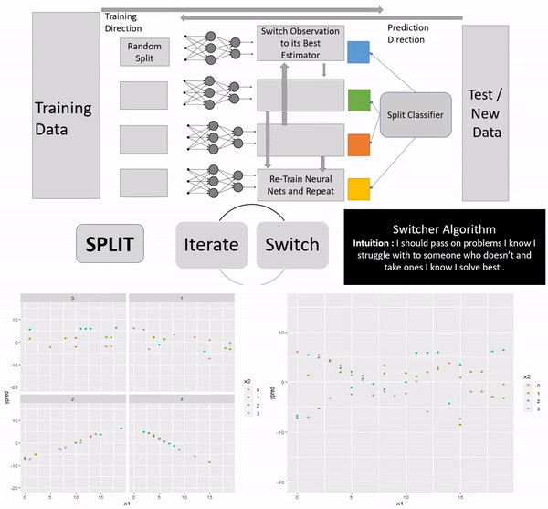

# Beyond Papers 

Trying to do small gradient update to AI/ML Research with keen interest to build community of "Code before Research paper","Random and open Experiments before perfect solution". Building value beyond papers
 
Each algorithm will have easy to understand underlying intution and architecture brief mentioned by concept contributors and collaborators. Before moving experimental to launched atleast 3 usage examples, associated medium post and concept video will be linked in the document for quick reference. 

## Launched:
Just getting started ...

## Live Experiments:

### **Switchers**: 
***Compatible with Tensorflow & Scikit-learn | Regression | Deeplearning for Tabular Data | Spit->Iterate<->Switch

Note: Might work fine with Pytorch or any other incremental learners as well. Testing under progress.

**Installation**: pip install beyondpapers

***Getting Started**
https://github.com/ai-beyondpapers/beyondpapers/blob/master/Switcher_Getting_Started.ipynb

*Reach out*: aibeyondpaper@gmail.com

**Motivation**: 
      Ensemble Trees are great fit for classification but are not good conceptual fit for Regression problems.  Deeplearning models which ideally must be good fit still fails in case of tabular data. In some cases tabular data might inherently have sub groups which behave differently in weights and direction which might need complex architechture choices like Tabnet.

Switcher makes an attempt to make deeplearning work for tabular data by enabling a versatile Ensemble framework.Its being built considering both beginner's ease of use and customisabliltity for advance user. 

**Architecture**: Switchers architecture choice revolves around Split, Iterate and Switch functions.

**Train Cycle**:  Split Data (unsupervised ) -> Repeat( Iterative Regression like Deep ANN) per Split <-> Switch observation to respective best learner ) <- Best Learner Classifier

**Test Cycle** :  Best Learner Classifier -> Regressor 

**Results** : In progress. Will be reported soon. Initial test indicated significant improvement on regression tasks compared to vanilla Deep ANN. 

    
